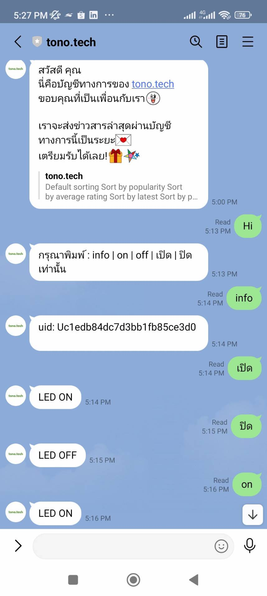

# tasmota-linebot-nodejs

```
# Usage:
npm install express
npm install body-parser
npm install request
npm install mqtt

export LINE_ACCESS_TOKEN=XXXXXXXX
export MQTT_PASSWD=XXXXXXXX

node index.js
```




Config Tasmota with MQTT Server


Ref:
- Tasmota Firmware for ESP Devices https://tasmota.github.io/docs/
- Free MQTT Server https://www.hivemq.com/
- LINE Messaging API https://developers.line.biz/
